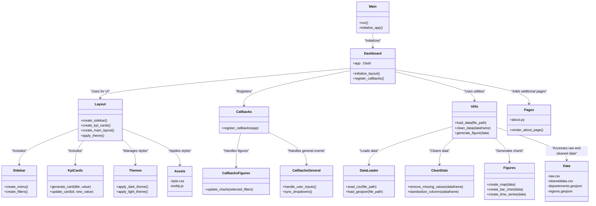

# 📖 Introduction
Ce projet vise à créer un dashboard interactif en Python basé sur des données Open Data. Il permet d’explorer, de visualiser et d’analyser des données d’intérêt public à l’aide de graphiques dynamiques et intuitifs.

# 📋 User Guide

## 🛠️ Prérequis
- Python 3.8 ou plus récent
- Les dépendances listées dans `requirements.txt`

## 🚀 Installation

1. Clonez le dépôt Git :
   ```bash
   git clone https://github.com/Zedoww/MiniProjet.git
   cd MiniProjet
   ```

2. Créez un environnement virtuel (recommandé) :
   ```bash
   python -m venv .venv
   source .venv/bin/activate
   # Sous Windows : .venv\Scripts\activate
   ```

3. Installez les dépendances :
   ```bash
   python -m pip install -r requirements.txt
   ```

## ▶️ Lancer le Dashboard

1. Exécutez le fichier principal :
   ```bash
   python main.py
   ```

2. Ouvrez un navigateur et accédez à l’URL suivante :
   ```
   http://127.0.0.1:8051/
   ```

# 📂 Data

## 📥 Sources des données
Le projet utilise des données géographiques et tabulaires, accessibles publiquement :
- **`departements.geojson`** : Départements français pour la visualisation cartographique.
- **`regions.geojson`** : Régions françaises.
- **`cleaneddata.csv`** : Données nettoyées et prêtes pour l’analyse.

### Transformation des données
Les étapes de nettoyage et de préparation sont gérées dans :
- **`utils/data_loader.py`** : Chargement des données brutes.
- **`utils/clean_data.py`** : Nettoyage des données brutes en supprimant les valeurs manquantes et standardisant les formats.

# 🛠️ Developer Guide

## 🧩 Architecture du code
Le projet suit une architecture modulaire :
- **`src/dashboard.py`** : Point d’entrée pour exécuter le tableau de bord.
- **`src/callbacks/`** : Gestion des interactions utilisateur via Dash callbacks.
- **`src/layout/`** : Organisation visuelle et composants du tableau de bord.
- **`src/utils/`** : Fonctions utilitaires pour la manipulation des données et la création des graphiques.

# 📊 Architecture du Projet

Voici le diagramme représentant l'architecture du projet, généré avec Mermaid :



## ➕ Ajouter une page ou un graphique
1. Créez un nouveau fichier dans `src/pages/`.
2. Définissez une disposition (layout) avec des composants Dash.
3. Ajoutez les callbacks correspondants dans `src/callbacks/`.
4. Enregistrez la page dans `dashboard.py` en l’ajoutant à la disposition principale.

# 📊 Rapport d'analyse

## Objectifs de l'analyse
Le projet vise à explorer et visualiser les données géographiques et statistiques à travers un tableau de bord interactif. Voici les principales conclusions :

## Tendances Générales des Températures
- ### Évolution annuelle
  Les températures augmentent progressivement au printemps et en été, atteignant des pics durant les mois estivaux. Une baisse marquée est observée en automne et en hiver, reflétant une forte saisonnalité.
- ### Fréquence des températures maximales
  La majorité des températures maximales se situe entre 10°C et 25°C. Quelques jours dépassent les 30°C, indiquant des épisodes de chaleur intense.
- ### Disparités régionales
  - **Régions du sud** (Provence-Alpes-Côte d'Azur, Corse) : températures moyennes supérieures à 16°C.
  - **Régions du nord et centre** (Normandie, Grand Est) : températures plus basses, reflétant un climat plus frais.

## Précipitations : Répartition et Intensité
- ### Répartition annuelle
  Les précipitations sont réparties tout au long de l’année avec des pics plus marqués au printemps et en automne.
- ### Cartographie des précipitations
  - **Régions de l'ouest** (Nouvelle-Aquitaine, Bretagne) : précipitations plus élevées.
  - **Régions méditerranéennes** : précipitations plus faibles malgré des températures plus élevées.
- ### Épisodes de fortes pluies
  Bien que les précipitations soient fréquentes (ex. : 227 jours à Prunay), l’intensité varie, avec quelques épisodes de pluies torrentielles visibles.

## Cartographie et Comparaisons Régionales
- ### Température moyenne par région
  - Les régions du sud bénéficient d’un climat plus chaud, avec des températures moyennes élevées.
  - Les régions du nord et du centre affichent des températures modérées à froides.
- ### Précipitations moyennes par région
  - Les régions proches de l’océan Atlantique (Bretagne, Nouvelle-Aquitaine) enregistrent des précipitations importantes.
  - Les régions méditerranéennes, bien que chaudes, présentent des précipitations plus faibles.

## Observations Globales
- ### Adaptabilité régionale
  Les contrastes régionaux suggèrent des implications pratiques, comme l’adaptation des pratiques agricoles ou la planification énergétique, en fonction des spécificités climatiques locales.
- ### Perspectives climatiques
  Les tendances relevées pourraient indiquer des changements climatiques régionaux. Une analyse sur plusieurs années serait nécessaire pour confirmer ces patterns émergents.

# 📜 Copyright

Je déclare sur l’honneur que le code fourni a été produit par moi/nous-même, à l’exception des lignes ci-dessous :

- **Structures empruntées** :
  Les callbacks, la structure des graphiques (y compris les `dcc.Dropdown`, `dcc.RangeSlider`), et l’affichage de la carte avec des points géographiques sont inspirés directement de la documentation Dash.
  Référence : [Documentation Dash](https://dash.plotly.com/)